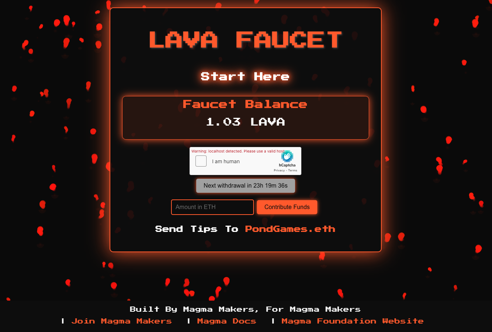

# LAVA FAUCET

## Description
LAVA FAUCET is a decentralized application (DApp) built on the Magma blockchain that allows users to claim LAVA tokens periodically. It serves as a faucet, distributing a predetermined amount of LAVA tokens to users who interact with it, thereby providing them with a small amount of cryptocurrency for testing or development purposes.

## Features
- **Claim LAVA Tokens**: Users can claim LAVA tokens at regular intervals by completing a captcha verification process.
- **Cool Animation**: A Matrix rain animation is displayed upon successful withdrawal of funds.
- **Network Compatibility Check**: The application checks if the user is connected to the correct blockchain network before allowing withdrawals.

## Dependencies
- **React**: A JavaScript library for building user interfaces.
- **ethers.js**: A library for interacting with the Ethereum blockchain.
- **@hcaptcha/react-hcaptcha**: A React component for integrating hCaptcha verification.
- **Web3.js**: A library for interacting with Ethereum-compatible blockchains.
- **FontAwesome**: Provides scalable vector icons that can be customized with CSS.
- **CSS Modules**: Enables modular and scoped CSS by default in React applications.

## Getting Started
To run the LAVA FAUCET locally, follow these steps:
1. Clone the repository: `git clone https://github.com/yourusername/lava-faucet.git`
2. Navigate to the project directory: `cd lava-faucet`
3. Install dependencies: `npm install`
4. Start the development server: `npm start`
5. Open your web browser and navigate to `http://localhost:3000`

## License
This project is licensed under the MIT License - see the [LICENSE](LICENSE) file for details.

## Acknowledgments
Special thanks to the developers of the Magma blockchain and the contributors to the open-source libraries used in this project.

